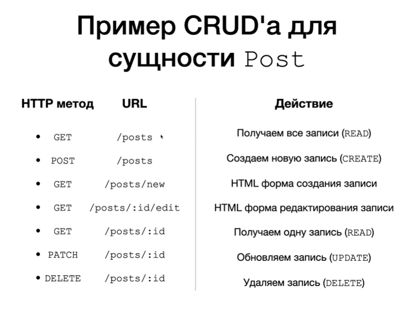
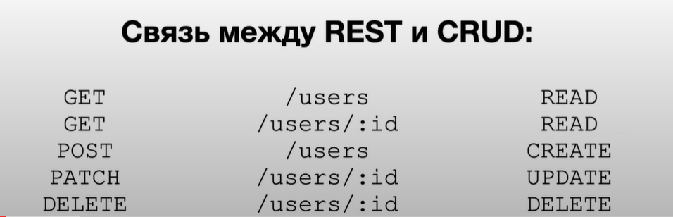
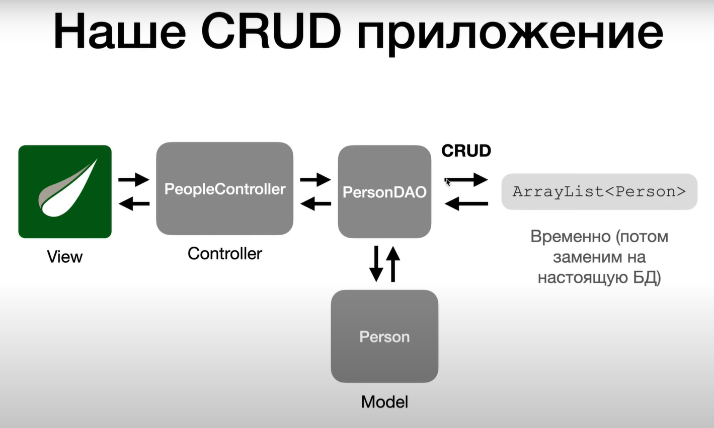

### Mixed

Рекомендуется создавать представления в директории, соответствующей названию контроллера, в чьем методе они вызываются.

GET /people - в URL используется форма в множественном числе.

PeopleController -> Person (<-model) - контроллер в множественном числе, модель в числе.

### CRUD

CRUD = CREATE, READ, UPDATE, DELETE.

CRUD-приложение - приложение, позволяющее добавлять, читать, обновлять и удалять данные. Чаще всего CRUD-приложения
являются веб-приложениями, т.е. доступ к БД предоставляется через протокол HTTP.

Клиент -/HTTP (Mappings)/-> CRUD-приложение на веб-сервере <-/CRUD/-> БД.

Конвенция:



Почему именно такие URL и HTTP методы? Это все описывается стандартом [REST](#rest).

### REST

REST - паттерн проектирования веб-приложений, описывает, как посредством протокола HTTP должен взаимодействовать клиент
с сервером. Все взаимодействие сводится к 4 операциям: получение данных (GET), добавление данных (POST), изменение
данных (PATCH/PUT), удаление данных (DELETE).

### CRUD & REST

CRUD - 4 базовые функции, используемые при работе с БД.

REST - паттерн проектирования веб-приложений. Описывает, как по протоколу HTTP взаимодействовать с сервером для чтения,
добавления, изменения, удаления данных.



CRUD-приложение может быть не веб-приложением, а просто приложением, работающим с БД.

# MVC

[Model](#model) - логика работы с данными.

[View](#view) - логика представления, интерфейс.

[Controller](#controllers) - логика навигации, обработка запросов.

## Controllers

@Controller - тот же @Component, но с дополнительными возможностями.

@Controller наследуется от @Component.

@ComponentScan работает с @Controller так же, как и с @Component.

Обычно контроллеры соответствуют одному URL-адресу и возвращают одно соответствующее представление.

### Mappings

- ```@GetMapping.``` Самый используемый запрос. Идемпотентный - на сервере ничего не меняется. _Тело запроса всегда
  пустое_. Если необходимо послать данные в Get запросе, они прописываются в URL: ?param=value. Параметры нужны для
  передачи информации от клиента к серверу во время запроса. Параметры передаются в формате
  ?ключ1=значение1&ключ2=значение2.
- ```@PostMapping.``` Цель запроса - **изменить что-то на сервере** (создание записи, аккаунта, загрузка фото). Все
  параметры хранятся _в теле запроса_, в URL никакие данные не хранятся. Есть специальный заголовок: content-type, в
  котором указывается тип данных, которые передаются в теле запроса. Тело запроса может содержать данные различных
  типов.
- @PutMapping
- @DeleteMapping
- @PatchMapping

Маппинги связывают метод контроллера с адресом, по которому можно к этому методу обратиться.

Устаревший вариант: ```@RequestMapping(method = RequestMethod.GET)```

Актуально использовать ```@RequestMapping("/address")``` над **классом**.

Структура запроса:

1. Стартовая строка: метод запроса, адрес, используемый протокол (напр: GET /wiki/java HTTP/1.1)
2. Заголовки (Headers)
3. Пустая строка, разделяющая заголовки и тело запроса
4. Тело запроса (Body), может быть пустым

### HTTP-responses

- 200 - все ОК
- 3хх - Редирект
- 4хх - ошибка клиента (браузера), напр, переход на несуществующую страницу
- 5хх - ошибка сервера, напр, нерабочая БД, ошибка в коде

### Get-request

Параметры Get-запроса можно получить двумя способами:

```
public String helloPage(HttpServletRequest request){ 
    String name = request.getParameter("name");
    return "view";
}
```

``` 
public void helloPage(@RequestParam("name") String name){
    return "view";
}
```

HttpServletRequest содержит все данные запроса.

Если в адресе запроса нет параметров, HttpServletRequest присваивает им значения null, а @RequestParam выдает ошибку,
т.к. ожидает данные параметры. Чтобы сделать параметры не обязательными, можно использовать
``` @RequestParam(value = "name", required = false) ``` - если параметры передаются, то они внедряются, если не
передаются, то в этих переменных будет лежать null.

## Model

Модель - контейнер для данных приложения.

### Controller-Model-View

Получение доступа к модели в контроллере:

```
public String hello(Model model) {
    model.setAttribute("key", "value");
    return "view";
}
``` 

Spring внедряет Model в метод контроллера автоматически.

### DAO

Паттерн DAO - Data Access Object.

Мы хотим вынести логику взаимодействия с БД из самой модели в отдельный класс. Паттерн проектирования, когда отдельный
класс занимается взаимодействием с БД для конкретной сущности называется DAO.

Вся логика работы с БД для модели Person инкапсулируется в класс PersonDAO. В DAO классах обычно пишется SQL код для
работы с БД приложения (чтение, запись, обновление, удаление).

Другой паттерн взаимодействия с БД - репозиторий, он представляет большую абстракцию над БД, чем ДАО.



## View

### Thymeleaf

<p th:text="${param}">Shows param value from model. This text will be replaced with dynamic model value param</p>

Подобие цикла в thymeleaf: временная переменная person указывает на каждый элемент передаваемой коллекции people.

```
<div th:each="person: ${people}"></div>
```

По сути то же самое, что и foreach. Для каждого person также возможно использование

```
<a th:text="${person.getName()}"}>user</a>
```

геттера, который есть у класса Person. "user" будет заменен значением person.getName().

```
<a th:href="@{/people/{id}(id=${person.getId()})}"></a>
```

1. person.getId() - с временной переменной цикла foreach достается ID.
2. временной переменной id присваивается полученное значение.
3. временная переменная id кладется в URL - динамически формируется правильный адрес для перехода по ссылке.
